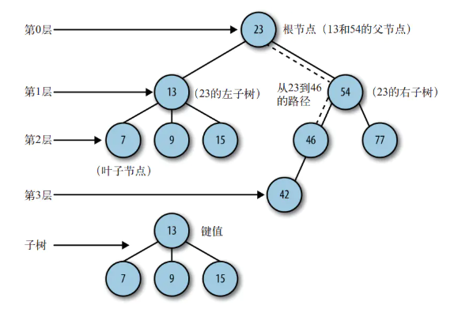

## 二叉树和二叉查找树
## 二叉树和二叉查找树
## 树的基本概念
- 一棵树最上面的几点称为根节点，如果一个节点下面连接多个节点，那么该节点成为父节点，它下面的节点称为子节点，一个节点可以有0个、1个或更多节点，没有子节点的节点叫叶子节点。


## 二叉树
- 一种特殊的树，即子节点最多只有两个，这个限制可以使得写出高效的插入、删除、和查找数据。在二叉树中，子节点分别叫左节点和右节点。


## 二叉查找树
- 二叉查找树是一种特殊的二叉树，相对较小的值保存在左节点中，较大的值保存在右节点中，这一特性使得查找的效率很高，对于数值型和非数值型数据，比如字母和字符串，都是如此。现在通过JS实现一个二叉查找树。


## 定义节点（实现二叉查找树）
```
function Node(data,left,right) {
    this.left = left;
    this.right = right;
    this.data = data;
    this.show = () => {return this.data}
}

节点：二叉树的最小结构单元
```
## 二叉树（实现二叉查找树）
```
function BST() {
    this.root = null //初始化,root为null
}
```
- 初始化时为根节点
- 如果BST.root === null ，那么就将节点作为根节点
- 如果BST.root !==null ，将插入节点进行一个比较，小于根节点，拿到左边的节点，否则拿右边，再次比较、递归。
```
最左变的叶子节点是最小的数，最右的叶子节点是最大的数
function insert(data) {
    var node = new Node(data,null,null);
    if(this.root === null) {
        this.root = node
    } else {
        var current = this.root;
        var parent;
        while(true) {
            parent = current;
            if(data < current.data) {
                current = current.left; //到左子树
                if(current === null) {  //如果左子树为空，说明可以将node插入在这里
                    parent.left = node;
                    break;  //跳出while循环
                }
            } else {
                current = current.right;
                if(current === null) {
                    parent.right = node;
                    break;
                }
            }
        }
    }
}
使用了一个循环方法，不断的去向子树寻找正确的位置。 循环和递归都有一个核心，就是找到出口，这里的出口就是当current 为null的时候，代表没有内容，可以插入。


接下来，将此方法写入BST即可
function BST() {
    this.root = null;
    this.insert = insert;
}


var bst = new BST()；
bst.insert(10);
bst.insert(8);
bst.insert(2);
bst.insert(7);
bst.insert(5);
```

## 二叉树遍历

1. 前序遍历: 56 22 10 30 81 77 92  （根左右）
2. 中序遍历: 10 22 30 56 77 81 92   （左根右）
3. 后序遍历: 10 30 22 77 92 81 56   （最后一层-左右根）

## 中序遍历
```
function inOrder(node) {
    if(node !== null) {
        //如果不是null，就一直查找左变，因此递归
        inOrder(node.left);
        //递归结束，打印当前值
        console.log(node.show());
        //上一次递归已经把左边搞完了，右边
        inOrder(node.right);
    }
}

//在刚才已有bst的基础上执行命令
inOrder(bst.root);

// 打印结果2 5 7 8 10
```

## 前序遍历
```
function preOrder(node) {
    if(node !== null) {
        //根左右
        console.log(node.show());
        preOrder(node.left);
        preOrder(node.right);
    }
}

```
## 后续遍历
```
function postOrder(node) {
    if(node !== null) {
        //左右根
        postOrder(node.left);
        postOrder(node.right);
        console.log(node.show())
    }
}
```

## 二叉树查找
- 最小值： 最左子树的叶子节点
- 最大值： 最右子树的叶子节点
- 特定值： target与current进行比较，如果比current大，在current.right进行查找，反之类似。

```
//最小值
function getMin(bst) {
    var current = bst.root;
    while(current.left !== null) {
        current = current.left;
    }
    return current.data;
}

//最大值
function getMax(bst) {
    var current = bst.root;
    while(current.right !== null) {
        current = current.right;
    }
    return current.data;
}

// 特定值
function find(target,bst) {
    var current = bst.root;
    while(current !== null) {
        if(target === current.data) {
            return true;
        }
        else if(target > current.data) {
            current = current.right;
        } else if(target < current.data) {
            current = current.left;
        }
    }
    return -1;
}
一个循环和判断，来不断的向下去寻找，这里的思想其实和二分查找是有点类似的。
```
