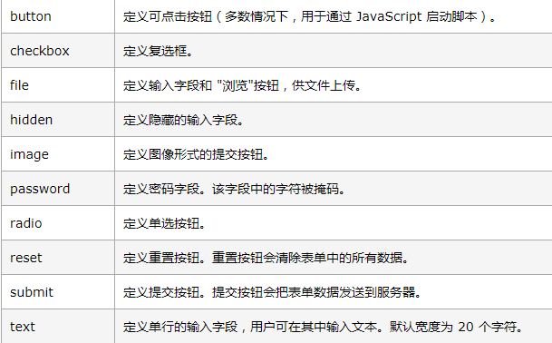

### form表单
- 方法
<form name="myForm" action="/action_page_post.php" onsubmit="return validateForm()" method="post">
姓名:   <input type="text" name="fname">  
        <input type="submit" value="Submit">
</form>

```
<form name="myForm" action="/action_page_post.php" onsubmit="return validateForm()" method="post">
姓名:   <input type="text" name="fname">  
        <input type="submit" value="Submit">
</form>
```

- 属性
disabled： 规定 input 元素应该被禁用  
max： 规定 input 元素的最大值  
min： 规定 input 元素的最小值  
pattern： 规定 input 元素的值模式  
required： 规定输入字段需要某个元素  
type： 规定 input 元素的类型 

### type属性值  

