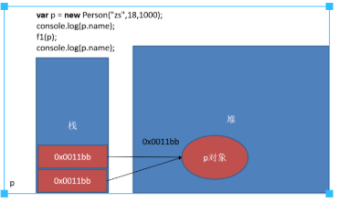

### 堆区和栈区
- 栈区（stack）— 由编译器自动分配释放 ，存放函数的参数值，局部变量的值等。
- 堆区（heap） — 一般由程序员分配释放， 若开发者不释放，程序结束时可能由OS回收 。

### JavaScript中的数据类型
#### 简单(基本)数据类型 Number、String、Boolean、Undefined、Null
- 直接存储值  
   
 
#### 复杂(引用)数据类型 Object、Array、Date.....
 - 存储引用  
   
