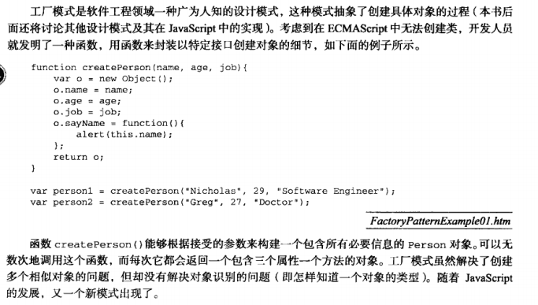

## 工厂模式


## 构造函数
- 构造函数就是一个普通的函数，创建方式和普通函数没有区别，不同的是构造函数习惯上首字母大写。
- 构造函数和普通函数的区别就是调用方式的不同，普通函数是直接调用，而构造函数需要使用new关键字来调用。
#### 执行流程
1. 立刻创建一个新的对象
2. 将新建的对象设置为函数中this, 在构造函数中可以使用this来引用新建的对象
3. 逐行执行函数中的代码
4. 将新建的对象作为返回值返回

#### **问题**
```
function Person(name,age,job){
    this.name = name;
    this.age = age;
    this.job = job;
    this.sayName = new Function("alert(this.name)")
}
每个构造函数上的Person实例，都包含一个不同的Function实例(以显示name属性)的本质。
以这种方式创建函数，会导致不同的作用域链和标识符解析。
person1.sayName  == person2.sayName  // false

——解决
创建两个完成同样任务的Function实例没有必要，有this对象在，不用在执行代码前就把函数绑定到特定的对象上。
function Person(name,age,job){
    this.name = name;
    this.age = age;
    this.job = job;
    this.sayName = sayName；
}
function sayName(){
    alert(this.name)
}
```

## 原型模式

#### 问题1
```
由其共享的本性导致
function Person() {

}
Person.prototype = {
    name: 'as',
    age: 11,
    job: 'asda',
    sayName: function(){
        alert(this.name);
    }
}
把Person.property设置为以对象字面量形式创建新对象。结果相同但其constructor属性不再指向Person

每创建一个函数，就会同时创建它的prototype对象，对象会自动获取constructor属性。这里本质上完全
重写了prototype对象，constructor属性也变成了新对象的constructor属性（指向object构造函数）
Person.prototype = {
    constructor： Person,
    name: 'as',
    age: 11,
    job: 'asda',
    sayName: function(){
        alert(this.name);
    }
}

```
#### 问题2


## 组合使用构造函数和原型模式
