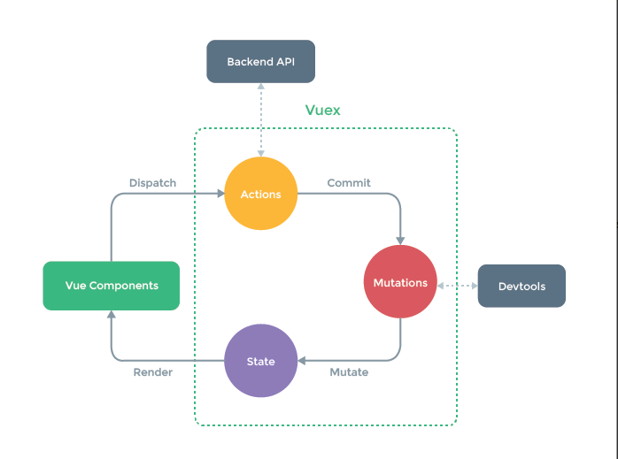

## vueX
1. 状态管理模式，解决了组件之间同一状态共享模式。（为vue组件之间数据共享开发的插件）


2. 方法： `https://www.cnblogs.com/xixinhua/p/10420177.html`，当组件需要修改数据的时候，必须遵循单向数据流
```
1. 点击函数用函数触发
 methods：{
            handleClick(){
               this.$store.dispatch("handleAdd")   //通过dispatch调用actions里的方法
           }
        }


2. 方法A中写触发Action的dispatch   this.$store.dispatch('方法名',参数)  

this.$store.dispatch('handleAdd', {
						stories: stories,
						ids: ids
					});


                

3. Actions中的每个方法都会接受一个对象 这个对象里面有一个commit方法，用来触发mutations里面的方法

actions:{
            handleAdd({commit}，params){     //第一个参数是个对象，解构赋值拿到对象中的commit；第二个参数是传递给mutations的参数
                commit("handlMutationseAdd")   //通过commit调用 mutations里的方法
            }
        }


4. Vuex 的 store 中的状态的唯一方法是提交mutations  (moutate)
 mutations:{
                handlMutationseAdd(state,params){     //vuex中state属性   params：commit触发时，传递过来的数据
                    console.log("mutations被调用了",params)
                    state.n++;
                    console.log(state.n)  
                }                          
            }

到此组件修改state中的数据完成，点击一次修改按钮n加1
接着页面上的数据重新进行了渲染----符合了vuex的特点数据是响应式的
```
3. **actions执行异步操作，mutation执行同步操作。**如果项目中有异步操作就用action，但是actions不一定需要，mutations是必须的，因为它是Vuex修改state的唯一推荐方法。
