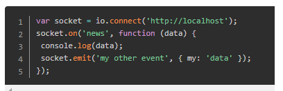

## 背景
#### 被动型
#### 方法
- http协议中的kee-alive   connection  是指在一次tcp连接中完成多个http请求，但是对每个请求仍要单独的发送header
- 所谓的polling（轮询）是指客户端不断的向服务器发送http请求，查询是否有新的数据
- http long poll :采用轮询，阻塞模式。发起请求后，没有消息，服务器一直不返回response给客户端，知道有消息才会返回，返回结束，再次建立连接
#### 缺点
- 消耗资源
- ajax轮询需要服务器有很快的处理速度，和资源
- long poll需要很高的并发，
#### 优点
- 建立持久连接
- 只需一次握手
- 服务器主动推送消息

## 基础概念
#### http请求缺点
- 单向请求
- 解决方法：（轮询）每个一段时间就发出一个询问
#### websocket
- 服务器可以主动的向客户端推送消息
- 建立在tcp协议之上
- 与http协议有着良好的兼容性，握手阶段采用http协议，因此握手时不容易被屏蔽，能通过各种的http服务器代理
- 数据格式轻，性能开销小，通信高效
- 可以发送文本，二进制文件
- 无同源策略，客户端可以与任意服务器通信

## http-websocket
- websocket和http都是基于tcp协议，tcp为传输层协议，websocket和http为应用层协议本质上为两种不同的东西，为兼容现有浏览器的握手规范，websocket的握手以http的形式发起，如果服务器不支持websocket，会把其当做一个不认识的http协议拒绝掉。
- 联系
	客户端建立连接时需要发送一个header标记的upgrad的http请求，标识协议升级。
	和http关联的是使用101状态码进行协议切换，tcp端口是80
- 区别
	持久化的协议

## websocket API
#### 创建一个websocket对象
- var Socket = new WebSocket(url, [protocal] );第一个参数用于指定要连接的url，第二个属性可选为端口
#### Socket.readyState表示连接状态
- 0 表示连接尚未建立。
- 1 表示连接已建立，可以进行通信。
- 2 表示连接正在进行关闭握手。
- 3 表示连接已经关闭或者连接不能打开。
#### 事件
- open		Socket.onopen	建立 socket 连接时触发这个事件。
- message	Socket.onmessage 客户端从服务器接收数据时触发。
- error		Socket.onerror	连接发生错误时触发。
- close		Socket.onclose	连接被关闭时触发。
#### 方法
- Socket.send()	send(data) 方法使用连接传输数据。
- Socket.close()	close() 方法用于终止任何现有连接。  
- 示例:   

## socket.io
- 开源库，包括客户端的Js，服务端的nodeJs
- Socket.IO支持4种协议：WebSocket、htmlfile、xhr-polling、jsonp-polling，它会自动根据浏览器选择适合的通讯方式
- 与websocket区别  
	1. socket.io封装了websocket，同时包含其他的连接方式，比如Ajax。  
	2.websocket协议本质上也是使用系统socket，它是把socket引入了http通信，也就是不使用80端口进行http通信。它的目的是建立全双工的连接，可以用来解决  
    3. 服务器客户端保持长连接的问题。
- 创建cosket.io客户端

	
在使用Socket.IO类库时，服务器端和客户端之间除了可以互相发送消息之外，也可以使用socket端口对象的emit方法，互相发送事件。

[参考链接][https://www.jianshu.com/p/95d259b05c67]